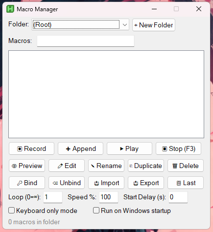

# Macro Manager

A lightweight AutoHotkey v2 macro recorder and manager for Windows. Record mouse and keyboard input, organize macros into folders, bind them to hotkeys, and replay them with loop/speed/delay controls — all from a single tray-based GUI.

## Features

- 🎬 **Record** mouse moves, clicks, and keystrokes to standalone `.ahk` files
- ▶️ **Playback** with adjustable loop count, speed %, and start-delay countdown
- 📁 **Folders** to organize macros (per-game, per-task, whatever you want)
- 🔑 **Hotkey bindings** that survive restarts and can be paused from the tray
- ⏸ **Pause/resume** mid-recording (F3) and **undo** the last action (F4)
- 💾 **Crash recovery** — autosaves the in-progress recording every 10 s
- 🔎 **Live search** to filter large macro lists
- 📥 **Import / export** self-contained scripts you can share
- 🖱 Right-click context menu, double-click to play
- 🚀 Optional **launch at Windows startup**

## Requirements

- Windows 10 or 11
- [AutoHotkey v2.0+](https://www.autohotkey.com/)

## Installation

1. Install AutoHotkey v2.
2. Download `AHK_Console.ahk` from the [latest release](../../releases) or clone this repo.
3. Double-click the `.ahk` file. It runs silently in the system tray.
4. Press **F1** to open the dashboard.

## Quick start

| Key | Action |
|---|---|
| **F1** | Open the dashboard |
| **F2** | Stop recording (save) |
| **F3** | Pause/resume recording • Stop playback |
| **F4** | Undo the last recorded action |

1. F1 → ⏺ Record → name the macro → Enter
2. Do whatever you want recorded
3. F2 to stop and save
4. Select the macro → ▶ Play (or double-click)

For the full walkthrough, see **[USAGE.md](USAGE.md)**.

## File locations

| Path | Purpose |
|---|---|
| `%USERPROFILE%\Documents\AutoHotkey\` | Your saved macros (and any subfolders) |
| `%APPDATA%\MacroManager\macromanager.ini` | Settings & hotkey bindings |
| `%TEMP%\macromgr_recover.tmp` | Crash-recovery autosave (transient) |

## Screenshots

## Contributing

Issues and PRs welcome. If you're proposing a new feature, please open an issue first so we can agree on scope before you write code.

## License

[MIT](LICENSE) © 2026 MakoDavid
